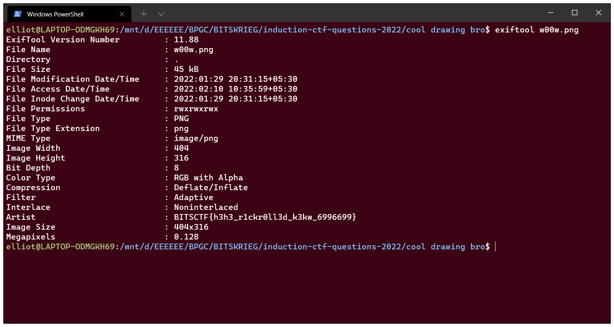

## cool drawing bro

- An image `w00w.png` was provided in the challenge.
  
- `Problem Statement`: "I wonder who the artist of this drawing is."
- Extremely easy challenge. All that needed to be done is check the metadata of the file.
- Use `exiftool w00w.png` in your linux terminal to get the flag.
  
- FLAG : `BITSCTF{h3h3_r1ckr0ll3d_k3kw_6996699}`
                                                        
- [Oh also, there was a hint.](https://www.youtube.com/watch?v=fC7oUOUEEi4)
